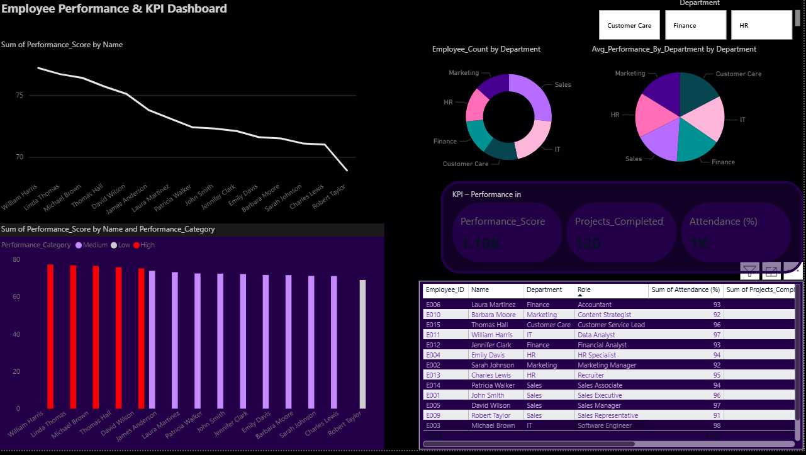

# Employee Performance Analysis & KPI Dashboard

**Objective:** Build an interactive dashboard to analyze employee performance and provide HR insights (attendance, projects, customer feedback, work hours).

**Tech stack:** Python (Pandas) → data cleaning, Power BI → dashboard & DAX.

---

## 📊 Dashboard Preview

---

## Files
- `data/employee_data.csv` — sample dataset
- `data/processed_employee_data.xlsx` — processed with performance score
- `code/employee_analysis.py` — Python script used to clean & compute KPI
- `powerbi/Employee_Performance_Dashboard.pbix` — Power BI report
- `exports/` — PDF & screenshots

## How to run
1. Run `code/employee_analysis.py` (requires pandas, openpyxl).
2. Open `powerbi/Employee_Performance_Dashboard.pbix` in Power BI Desktop and refresh data.

## Key KPIs & measures
- `Performance_Score` — weighted score (Attendance, Projects, Feedback, Work_Hours)
- `Performance_Category` — High / Medium / Low (DAX)
- Department average performance (DAX measure)

## Findings (example)
- Sales & IT show higher average performance.
- Some Sales reps have high sales but lower feedback; targeted training recommended.

---

**Contact:** aagamjainaj12@gmail.com
